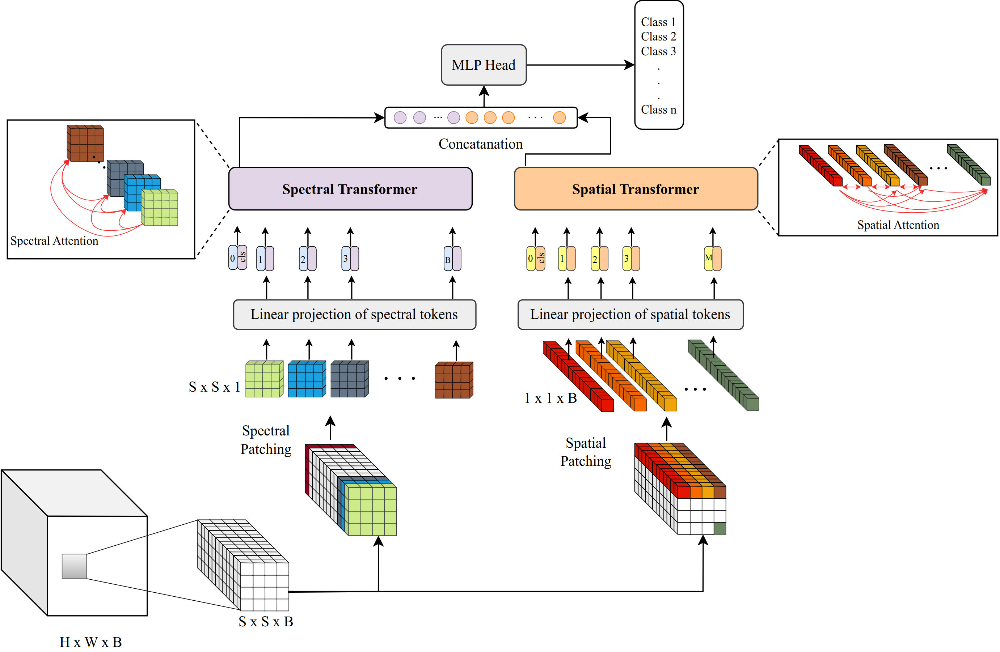

# FactoFormer: Factorized Hyperspectral Transformers with Self-Supervised Pre-Training

The official repository of the paper [FactoFormer: Factorized Hyperspectral Transformers with Self-Supervised Pre-Training](https://ieeexplore.ieee.org/document/10360846) Accepted to IEEE Transactions on Geoscience and Remote Sensing.

[//]: # (We introduce a novel factorized transformer architecture called _FactoFormer_ with self-supervised pretraining for hyperspectral data. This network architecture enables factorized self-attention and factorized self-supervised pre-training focusing on learning salient representations in both spectral and spatial dimensions.)

### Abstract
Hyperspectral images (HSIs) contain rich spectral and spatial information. Motivated by the success of transformers in the field of natural language processing and computer vision where they have shown the ability to learn long range dependencies within input data, recent research has focused on using transformers for HSIs. However, current state-of-the-art hyperspectral transformers only tokenize the input HSI sample along the spectral dimension, resulting in the under-utilization of spatial information. Moreover, transformers are known to be data-hungry and their performance relies heavily on large-scale pre-training, which is challenging due to limited annotated hyperspectral data. Therefore, the full potential of HSI transformers has not been fully realized. To overcome these limitations, we propose a novel factorized spectral-spatial transformer that incorporates factorized self-supervised pre-training procedures, leading to significant improvements in performance. The factorization of the inputs allows the spectral and spatial transformers to better capture the interactions within the hyperspectral data cubes. Inspired by masked image modeling pre-training, we also devise efficient masking strategies for pre-training each of the spectral and spatial transformers. We conduct experiments on six publicly available datasets for HSI classification task and demonstrate that our model achieves state-of-the-art performance in all the datasets.



## News
- Pre-training code will be released in January 2024.
- [2023-12] Fine-tuning and testing code released with pre-trained models.

Usage
---------------------
<b>Set up the environment and install required packages</b>
  
  - Create [conda](https://docs.conda.io/en/latest/) environment with python:
  ```bash
  conda create --name factoformer python=3.7
  conda activate factoformer
  ```
  - Install PyTorch with suitable cudatoolkit version. See [here](https://pytorch.org/):
  ```bash
  conda install pytorch==1.13.1 torchvision==0.14.1 torchaudio==0.13.1 pytorch-cuda=11.6 -c pytorch -c nvidia
  ```
  -  Install other requirements:
  ```bash
  pip install -r requirements.txt
  ```

<b>Download datasets and pre-trained checkpoints</b>

- Download Indian Pines, University of Pavia and Houston datasets using the link provided in [SpectralFormer](https://github.com/danfenghong/IEEE_TGRS_SpectralFormer)
- Download Wuhan datasets with .mat file format from [here](http://rsidea.whu.edu.cn/resource_WHUHi_sharing.htm). (download the split with 100 samples per class)
- Download our pre-trained and fine-tuned checkpoints from the links provided in the following table.

<table>
<thead>
  <tr>
    <th>Dataset</th>
    <th>Overall Acc. (%)</th>
    <th>Average Acc. (%)</th>
    <th colspan="2">Pre-trained Model</th>
    <th colspan="2">Fine-tuned Model</th>
  </tr>
</thead>
<tbody>
  <tr>
    <td>Indian Pines</td>
    <td style="text-align: center;">91.30</td>
    <td style="text-align: center;">94.30</td>
    <td><a href="https://www.dropbox.com/scl/fi/a05dx1nbz6e8ohgpmsdmc/pretrained_spatial.pth?rlkey=k2buvu9h4lscnjhv334x1jv6z&dl=0">spatial_ckpt</a></td>
    <td><a href="https://www.dropbox.com/scl/fi/adpm9qm12bqdye5mlkp1h/pretrained_spectral.pth?rlkey=utctcrssg1kra05594szfcrox&dl=0">spectral_ckpt</a></td>
    <td><a href="https://www.dropbox.com/scl/fi/2n5e0rc8cka4xclny6fjk/IndianPines_ft.pt?rlkey=lzqx943hh52twxvihmlgnviji&dl=0">finetuned_ckpt</a></td>
    
  </tr>
  <tr>
    <td>University of Pavia</td>
    <td style="text-align: center;">95.19</td>
    <td style="text-align: center;">93.64</td>
    <td><a href="https://www.dropbox.com/scl/fi/pan3q5zfwd2wtptxlic21/pretrained_spatial.pth?rlkey=0hvcibc4qtjqu8a890rxrwr1n&dl=0">spatial_ckpt</a></td>
    <td><a href="https://www.dropbox.com/scl/fi/cuskvw6le49vkcvkqoela/pretrained_spectral.pth?rlkey=4ydhn09qydt8yj286numj6e25&dl=0">spectral_ckpt</a></td>
    <td><a href="https://www.dropbox.com/scl/fi/44zv1tsyi76slnp28yxjj/Pavia_ft.pt?rlkey=vdfnxe0dk8b5yp0wkhd2tt86j&dl=0">finetuned_ckpt</a></td>
  </tr>
  <tr>
    <td>Houston 2013</td>
    <td style="text-align: center;">89.13</td>
    <td style="text-align: center;">90.12</td>
    <td><a href="https://www.dropbox.com/scl/fi/dbh7esbf042e56x2xnw59/pretrained_spatial.pth?rlkey=61kw6c4203rycuq409mftb76o&dl=0">spatial_ckpt</a></td>
    <td><a href="https://www.dropbox.com/scl/fi/kzzd5lrwlehvgnjlip326/pretrained_spectral.pth?rlkey=uqmeyuaxlj6dkmwdo4r8z4n89&dl=0">spectral_ckpt</a></td>
    <td><a href="https://www.dropbox.com/scl/fi/ezeodymn9ox1pmsmowkyv/Houston_ft.pt?rlkey=h8d8nwy0uap5ozi4omlc18llm&dl=0">finetuned_ckpt</a></td>
  </tr>
   <tr>
    <td>WHU-Hi-LongKou</td>
    <td style="text-align: center;">98.30</td>
    <td style="text-align: center;">98.72</td>
    <td><a href="https://www.dropbox.com/scl/fi/go3gd0e7xmumg7fmfn1k2/pretrained_spatial.pth?rlkey=jyuyxa4m9at0lm3n2c3rl8ccd&dl=0">spatial_ckpt</a></td>
    <td><a href="https://www.dropbox.com/scl/fi/u6gsf8vonxm7jccf41nvn/pretrained_spectral.pth?rlkey=68f2afmnfwe3xwhvb8qgwkree&dl=0">spectral_ckpt</a></td>
    <td><a href="https://www.dropbox.com/scl/fi/iau0iyfgj3t6wiw1t47o0/WHU-Hi-LK_ft.pt?rlkey=527sgoy2ycjxd7ubl6e3drkzt&dl=0">finetuned_ckpt</a></td>
  </tr>
  <tr>
    <td>WHU-Hi-HanChuan</td>
    <td style="text-align: center;">93.19</td>
    <td style="text-align: center;">91.64</td>
    <td><a href="https://www.dropbox.com/scl/fi/9ome9i0kcb4zj861sqbh5/pretrained_spatial.pth?rlkey=sz492a44a81gjtffxzy817l3f&dl=0">spatial_ckpt</a></td>
    <td><a href="https://www.dropbox.com/scl/fi/yslzx0aeb70dpmtd5663c/pretrained_spectral.pth?rlkey=9y7skxa65zkmrlbpit9iobw2e&dl=0">spectral_ckpt</a></td>
    <td><a href="https://www.dropbox.com/scl/fi/f9wswfrh9jogov8zyc46v/WHU-Hi-HC_ft.pt?rlkey=jfvfy2lrpkjc0pfllcwm7603h&dl=0">finetuned_ckpt</a></td>
  </tr>
  <tr>
    <td>WHU-Hi-HongHu</td>
    <td style="text-align: center;">92.26</td>
    <td style="text-align: center;">92.38</td>
    <td><a href="https://www.dropbox.com/scl/fi/6ipjbnb2i85foro3cp42r/pretrained_spatial.pth?rlkey=57t0v5ti5cvchn7ge1yeoxt1g&dl=0">spatial_ckpt</a></td>
    <td><a href="https://www.dropbox.com/scl/fi/sniql4ml73mdu1u0c70jo/pretrained_spectral.pth?rlkey=w2b641ymzugxfj6g7lh4l9jqv&dl=0">spectral_ckpt</a></td>
    <td><a href="https://www.dropbox.com/scl/fi/c0bevcc3flcyj1zf2kpw8/WHU-Hi-HH_ft.pt?rlkey=a3ix8vlkgpxubzini0ewqx6ss&dl=0">finetuned_ckpt</a></td>
  </tr>
 
    
</tbody>
</table>

Evaluation
---------------------
For recreating the results reported in the paper using the fine-tuned checkpoints:
- eg. Running evaluation with Indian Pines dataset
  ```bash
  python test.py --dataset='Indian' --model_path='<path_to_ckpt>'
  ```
For evaluatng on other datasets change the `--dataset` argument to `Pavia`, `Houston`, `WHU-Hi-HC`, `WHU-Hi-HH`, `WHU-Hi-LK` and replace `<path_to_ckpt>` with the path to the relevant checkpoint. 


Finetuning
---------------------
For fine-tuning FactoFormer using the pretrained models:
- Indian Pines:
    ```bash
    python main_finetune.py --dataset='Indian' --epochs=80 --learning_rate=3e-4 --pretrained_spectral='<path_to_ckpt>' --pretrained_spatial='<path_to_ckpt>' --output_dir='<path_to_out_dir>'
    ```
 - University of Pavia:
      ```bash
      python main_finetune.py --dataset='Pavia' --epochs=80 --learning_rate=1e-3 --pretrained_spectral='<path_to_ckpt>' --pretrained_spatial='<path_to_ckpt>' --output_dir='<path_to_out_dir>'
      ```
 - Houston:
      ```bash
      python main_finetune.py --dataset='Houston' --epochs=40 --learning_rate=2e-3 --pretrained_spectral='<path_to_ckpt>' --pretrained_spatial='<path_to_ckpt>' --output_dir='<path_to_out_dir>'
      ```
- Wuhan has three datasets namely WHU-Hi-HanChuan, WHU-Hu-HongHu and WHU-Hi-LongKou. Use the following snippet and change the `--dataset` argument to `WHU-Hi-HC`, `WHU-Hi-HH` and `WHU-Hi-LK` for fune-tuning on each dataset:
     ```bash
      python main_finetune.py --dataset='WHU-Hi-HC' --epochs=40 --learning_rate=1e-3 --pretrained_spectral='<path_to_ckpt>' --pretrained_spatial='<path_to_ckpt>' --output_dir='<path_to_out_dir>'
    ```

Replace `<path_to_out_dir>` with the relevant path to the pre-trained checkpoints and replace `<path_to_out_dir>` with the path to intended output directory

## How to cite our paper
Please use the following bibtex reference to cite our paper.
```bibtex
@ARTICLE{10360846,
  author={Mohamed, Shaheer and Haghighat, Maryam and Fernando, Tharindu and Sridharan, Sridha and Fookes, Clinton and Moghadam, Peyman},
  journal={IEEE Transactions on Geoscience and Remote Sensing}, 
  title={FactoFormer: Factorized Hyperspectral Transformers with Self-Supervised Pre-Training}, 
  year={2023},
  volume={},
  number={},
  pages={1-1},
  doi={10.1109/TGRS.2023.3343392}}

```

## Acknowledgement
We would like acknowledge the following repositories: [SpectralFormer](https://github.com/danfenghong/IEEE_TGRS_SpectralFormer), [MAEST](https://github.com/ibanezfd/MAEST/tree/main) and [SimMIM](https://github.com/microsoft/SimMIM).

